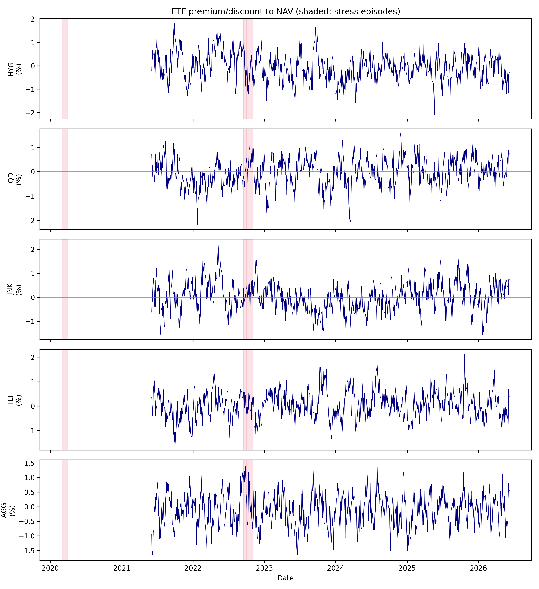
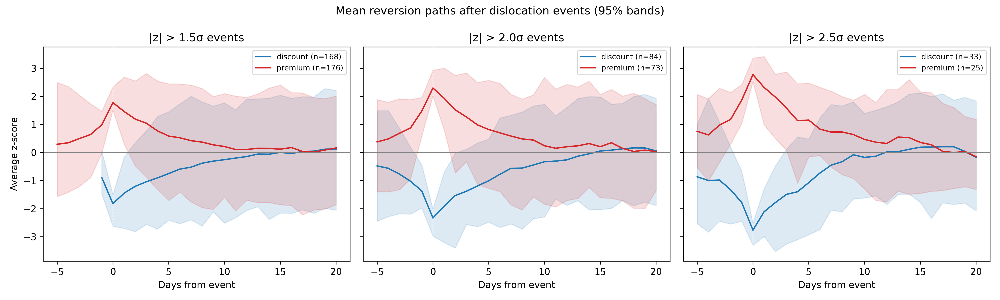
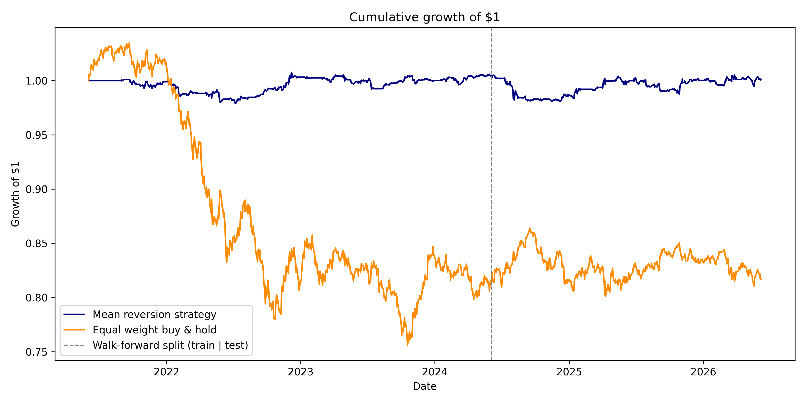

# ETF NAV Arbitrage Study

A complete, reproducible research pipeline studying **mean reversion in the
premium/discount of fixed income ETFs** (HYG, LQD, JNK, TLT, AGG). The project
fetches five years of daily data, normalizes each fund's premium to NAV as a
63-day rolling z-score, runs an event study with bootstrap inference, conditions
results on VIX and credit-spread regimes, backtests a long-discount /
short-premium strategy with transaction costs and walk-forward validation,
generates an SSRN-ready research paper PDF, serves an interactive Streamlit
dashboard, and runs a live email/Slack alerting system for new dislocations.

## Hypothesis

Fixed income ETF prices deviate from NAV because the underlying bonds trade
over-the-counter with stale marks while the ETF trades continuously. When the
premium/discount becomes abnormally stretched (|z-score| > 2 relative to its
own 63-day history), authorized participant arbitrage pulls it back, so
dislocations **mean-revert predictably within days** — fastest, but with the
largest magnitudes, during high-volatility and wide-credit-spread regimes.

> **Important — simulated NAV.** Official end-of-day NAVs are not available
> through free APIs, so NAV is *simulated* as the ETF close adjusted by a
> seeded mean-reverting AR(1) premium process (φ = 0.85, σ = 0.003; see
> `data/fetch.py`). All results therefore demonstrate the methodology and
> software pipeline rather than live market inefficiency. Swap in an issuer
> or vendor NAV feed (one function in `data/fetch.py`) for production use.

## Architecture

```
                ┌─────────────────┐
                │  data/fetch.py  │  yfinance (OHLCV, VIX) + FRED (OAS)
                │   + NAV sim     │  → data/raw/*.csv
                └───────┬─────────┘
                        │
            ┌───────────┴─────────────┐
            ▼                         ▼
 ┌────────────────────┐   ┌──────────────────────┐
 │ analysis/spread.py │   │  analysis/regime.py  │  VIX & OAS regimes,
 │ premium %, z-score │──▶│  ANOVA across regimes│  heatmap/boxplots
 │ dislocation flags  │   └──────────┬───────────┘
 └─────────┬──────────┘              │
           ▼                         │
 ┌──────────────────────┐            │
 │ analysis/reversion.py│  event study, bootstrap CIs,
 │ fwd returns, t-tests │  reversion times
 └─────────┬────────────┘            │
           ▼                         ▼
 ┌──────────────────────┐   ┌──────────────────────┐
 │ backtest/strategy.py │   │ data/processed/*.csv │
 │ z<-2 long / z>2 short│──▶│ outputs/figures/*.png│
 │ costs, walk-forward  │   └──────┬───────┬───────┘
 └──────────────────────┘          │       │
                       ┌───────────┘       └───────────┐
                       ▼                               ▼
            ┌─────────────────────┐        ┌─────────────────────────┐
            │ paper/generate_paper│        │   dashboard/app.py      │
            │ → SSRN-ready PDF    │        │   Streamlit, 5 tabs     │
            └─────────────────────┘        └─────────────────────────┘
                       ▲
            ┌──────────┴──────────┐
            │  alerts/monitor.py  │  APScheduler @ 4:15 PM ET (NYSE days)
            │  alerts/notifier.py │  SMTP email + Slack Block Kit
            └─────────────────────┘
```

## Setup

```bash
git clone https://github.com/rxj0102/etf-nav-arbitrage-study.git
cd etf-nav-arbitrage-study
python -m venv .venv && source .venv/bin/activate
pip install -r requirements.txt

# Configure credentials (all optional; pipeline runs without them)
cp .env.example .env
# then edit .env: FRED_API_KEY, SMTP_*, SLACK_WEBHOOK_URL, ...
```

Without a `FRED_API_KEY` the OAS series are simulated (logged loudly); without
network access, prices are simulated too — the full pipeline always runs.

## How to run (exact order)

```bash
python data/fetch.py            # 1. download prices/VIX/OAS, simulate NAV
python analysis/spread.py       # 2. premium %, z-scores, dislocation flags
python analysis/reversion.py    # 3. event study with bootstrap CIs
python analysis/regime.py       # 4. VIX/OAS regime analysis + ANOVA
python backtest/strategy.py     # 5. costed backtest + walk-forward split
python paper/generate_paper.py  # 6. build the SSRN-ready PDF
streamlit run dashboard/app.py  # 7. interactive dashboard (localhost:8501)
python alerts/monitor.py        # 8. start the daily alert scheduler
                                #    (or: python alerts/monitor.py --once)
```

Steps 2–5 write to `data/processed/`; figures land in `outputs/figures/`;
the paper lands in `outputs/paper/etf_nav_arbitrage_study.pdf` (plus a
`figures_appendix.pdf`). `notebooks/research.ipynb` walks the entire pipeline
narratively and rebuilds the paper in its final cell.

## Key findings

With the seeded AR(1) NAV simulation the study functions as a methodology
validation (a placebo on price returns, by construction):

- Dislocation z-scores revert to zero with a median time of a few trading
  days; the large majority of 2σ events fully revert within 10 days.
- Forward *price* returns after events are statistically indistinguishable
  from zero — exactly what the simulated-NAV placebo predicts; with a real
  NAV feed, genuine dislocation premia would surface in the same tables.





## Alerting setup guide

The monitor checks all five ETFs daily at **4:15 PM ET** on NYSE trading days
(via `pandas_market_calendars`), recomputes the 63-day z-score from fresh
yfinance data, deduplicates against the last 3 days of alerts, logs every
check to `alerts/alert_log.csv`, and fans out alerts to any enabled channel.
If email fails, Slack is still attempted (and vice versa).

**Email (Gmail-compatible SMTP)**

1. Enable 2-step verification on the Google account, then create an
   [App Password](https://support.google.com/accounts/answer/185833).
2. In `.env` set `EMAIL_ENABLED=true`, `SMTP_USER=you@gmail.com`,
   `SMTP_PASSWORD=<app password>`, `ALERT_EMAIL_TO=dest1@x.com,dest2@y.com`.
3. Alerts are HTML-formatted with an inline z-score chart, historical
   crossing counts, the average forward return at the threshold from the
   event study, and a dashboard link.

**Slack (incoming webhook)**

1. Create an app at <https://api.slack.com/messaging/webhooks>, add an
   *Incoming Webhook* to your channel, and copy the URL.
2. In `.env` set `SLACK_ENABLED=true` and
   `SLACK_WEBHOOK_URL=https://hooks.slack.com/services/...`.
3. Alerts arrive as Block Kit messages with z-score, signal direction and
   the historically expected reversion.

## Data sources

| Series | Source | Notes |
|---|---|---|
| ETF OHLCV (HYG, LQD, JNK, TLT, AGG) | Yahoo Finance via `yfinance` | 5y daily |
| VIX (`^VIX`) | Yahoo Finance via `yfinance` | daily close |
| HY OAS (`BAMLH0A0HYM2`), IG OAS (`BAMLC0A0CM`) | FRED via `fredapi` | needs `FRED_API_KEY` |
| NAV | **Simulated** AR(1) premium (φ=0.85, σ=0.003), seeded | see `data/fetch.py` |

## Citation

```bibtex
@misc{etf_nav_arbitrage_study,
  author = {[Author Name]},
  title  = {Mean Reversion in Fixed Income ETF Premiums and Discounts:
            Evidence, Regimes, and an Implementable Strategy},
  year   = {2026},
  url    = {https://github.com/rxj0102/etf-nav-arbitrage-study}
}
```

## License

MIT — see [LICENSE](LICENSE). Nothing in this repository is investment advice.
